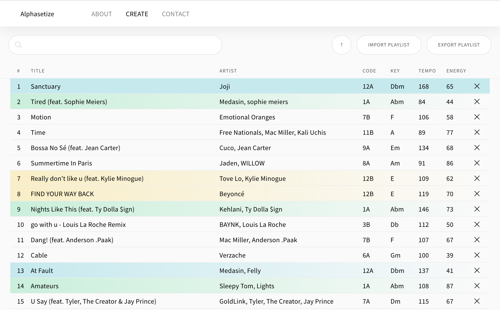

# [Alphasetize](https://alphasetize.com/)

**Alphastize** is a front end web application that uses the Spotify API and user's personal Spotify accounts to help users order songs in your sets/playlists based on key compatibility.

[React](https://reactjs.org) - [Redux](https://redux.js.org/) - [Spotify API](https://developer.spotify.com/documentation/)

## Features

### List view

-   Import song via search
-   Import existing user playlist
-   Identify songs with compatible keys
-   Reorder songs (click + drag) as desired
-   Export organized set as new playlist

-   Interact with the Camelot Wheel - used to visually indicate key compatibility
